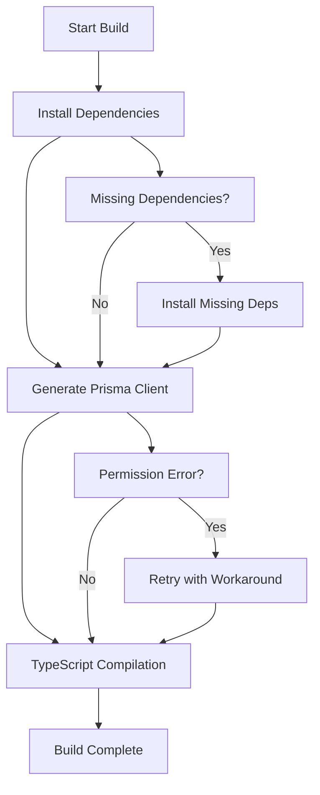
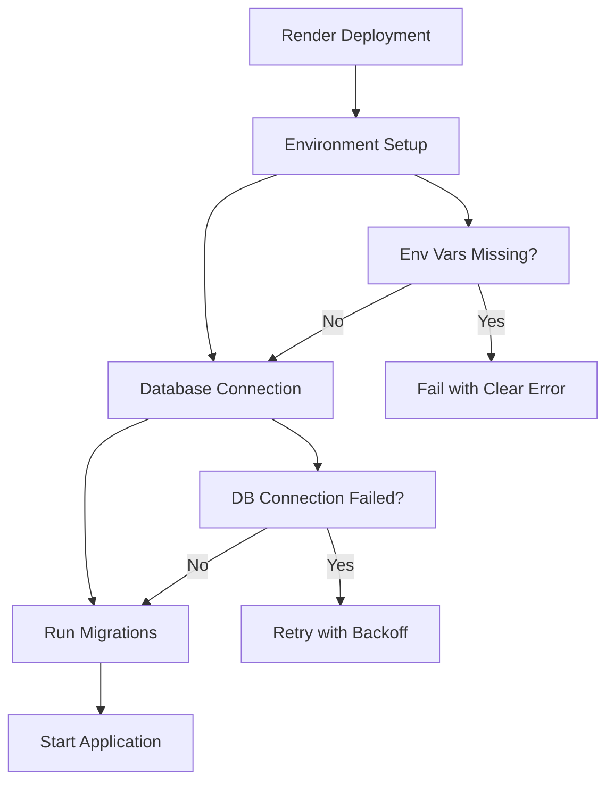

# Design Document

## Overview

The backend deployment fix addresses multiple issues preventing successful deployment of the Jollof Palace backend. The primary issues identified are:

1. **Prisma Client Generation Permission Error**: Windows-specific EPERM error during `prisma generate`
2. **Build Script Configuration**: Potential issues with build command sequencing
3. **Environment Variable Handling**: Missing or misconfigured environment variables
4. **Deployment Configuration**: Render.yaml configuration may need optimization

## Architecture

### Build Process Flow

### Deployment Architecture

## Components and Interfaces

### 1. Build Script Enhancement

**Purpose**: Improve build reliability and error handling

**Key Changes**:
- Add retry logic for Prisma generation
- Implement cross-platform file handling
- Add build validation steps
- Improve error messaging

### 2. Prisma Configuration Optimization

**Purpose**: Resolve Windows permission issues and improve generation reliability

**Key Changes**:
- Configure Prisma for cross-platform compatibility
- Add fallback strategies for client generation
- Implement proper cleanup procedures
- Add generation validation

### 3. Environment Configuration Validation

**Purpose**: Ensure all required environment variables are properly set

**Key Changes**:
- Add environment validation script
- Implement graceful fallbacks for optional variables
- Add clear error messages for missing required variables
- Create environment setup documentation

### 4. Deployment Configuration Updates

**Purpose**: Optimize Render deployment configuration

**Key Changes**:
- Update build commands for reliability
- Configure proper environment variable handling
- Add health check endpoints
- Implement proper startup sequence

## Data Models

No new data models are required. The existing Prisma schema remains unchanged.

## Error Handling

### Build Errors

1. **Prisma Generation Failures**
   - Implement retry mechanism with exponential backoff
   - Add file system permission checks
   - Provide clear error messages with resolution steps
   - Add fallback to manual client generation

2. **TypeScript Compilation Errors**
   - Validate TypeScript configuration
   - Check for missing type definitions
   - Provide detailed error reporting
   - Add pre-compilation validation

3. **Dependency Issues**
   - Validate package.json integrity
   - Check for version conflicts
   - Implement dependency resolution strategies
   - Add clear dependency error messages

### Runtime Errors

1. **Database Connection Issues**
   - Implement connection retry logic
   - Add connection health checks
   - Provide clear database error messages
   - Add graceful degradation for optional features

2. **Environment Variable Issues**
   - Validate required environment variables at startup
   - Provide clear error messages for missing variables
   - Add environment variable documentation
   - Implement secure default values where appropriate

## Testing Strategy

### Build Testing

1. **Cross-Platform Build Tests**
   - Test build process on Windows, macOS, and Linux
   - Validate Prisma generation on different platforms
   - Test build script reliability and error handling
   - Verify TypeScript compilation consistency

2. **Environment Testing**
   - Test with various environment configurations
   - Validate environment variable handling
   - Test deployment configuration scenarios
   - Verify error handling for missing variables

### Deployment Testing

1. **Render Deployment Tests**
   - Test deployment configuration
   - Validate build command execution
   - Test database migration process
   - Verify application startup sequence

2. **Integration Testing**
   - Test database connectivity
   - Validate API endpoint functionality
   - Test environment-specific configurations
   - Verify logging and error reporting

### Performance Testing

1. **Build Performance**
   - Measure build time optimization
   - Test parallel build processes
   - Validate caching strategies
   - Monitor resource usage during builds

2. **Startup Performance**
   - Measure application startup time
   - Test database connection performance
   - Validate service initialization
   - Monitor memory and CPU usage

## Implementation Approach

### Phase 1: Immediate Fixes
- Fix Prisma generation permission issues
- Update build scripts for reliability
- Validate and fix environment configuration
- Test local build process

### Phase 2: Deployment Optimization
- Update Render configuration
- Implement proper error handling
- Add health check endpoints
- Test deployment process

### Phase 3: Monitoring and Validation
- Add build and deployment monitoring
- Implement automated testing
- Create deployment documentation
- Add troubleshooting guides

## Security Considerations

1. **Environment Variable Security**
   - Ensure sensitive variables are properly secured
   - Validate environment variable access patterns
   - Implement secure default configurations
   - Add environment variable validation

2. **Build Security**
   - Validate dependency integrity
   - Implement secure build processes
   - Add build artifact validation
   - Ensure proper file permissions

## Monitoring and Logging

1. **Build Monitoring**
   - Log build process steps
   - Monitor build success/failure rates
   - Track build performance metrics
   - Add build error categorization

2. **Deployment Monitoring**
   - Monitor deployment success rates
   - Track deployment performance
   - Log deployment errors and issues
   - Add deployment health checks